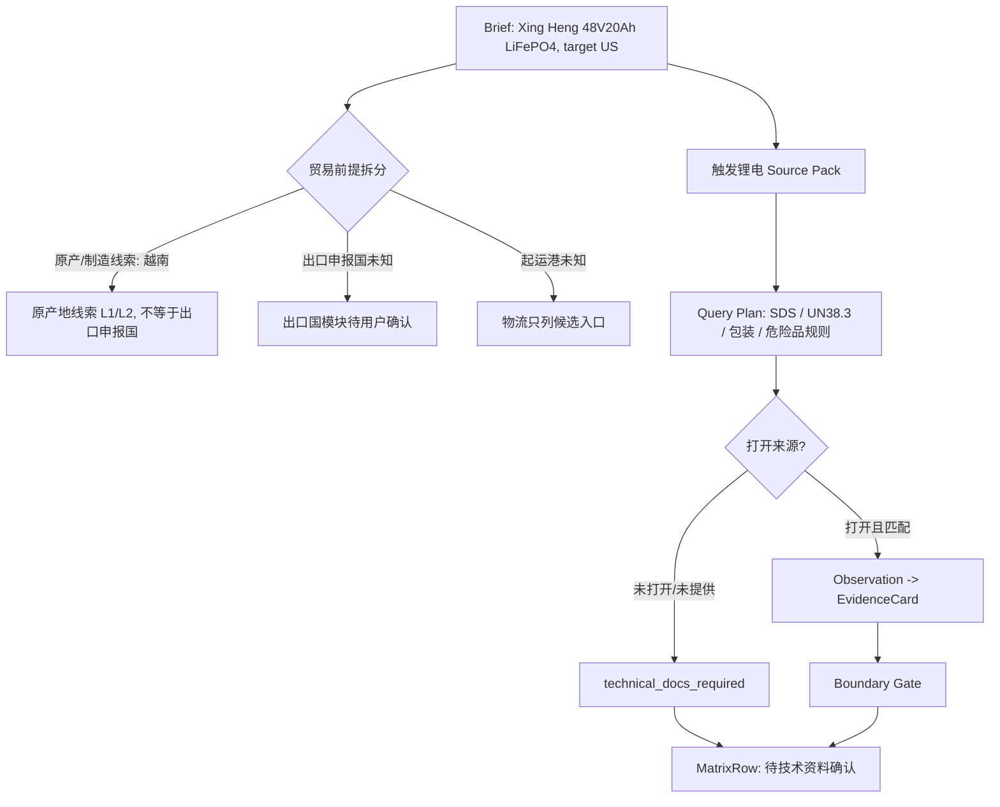
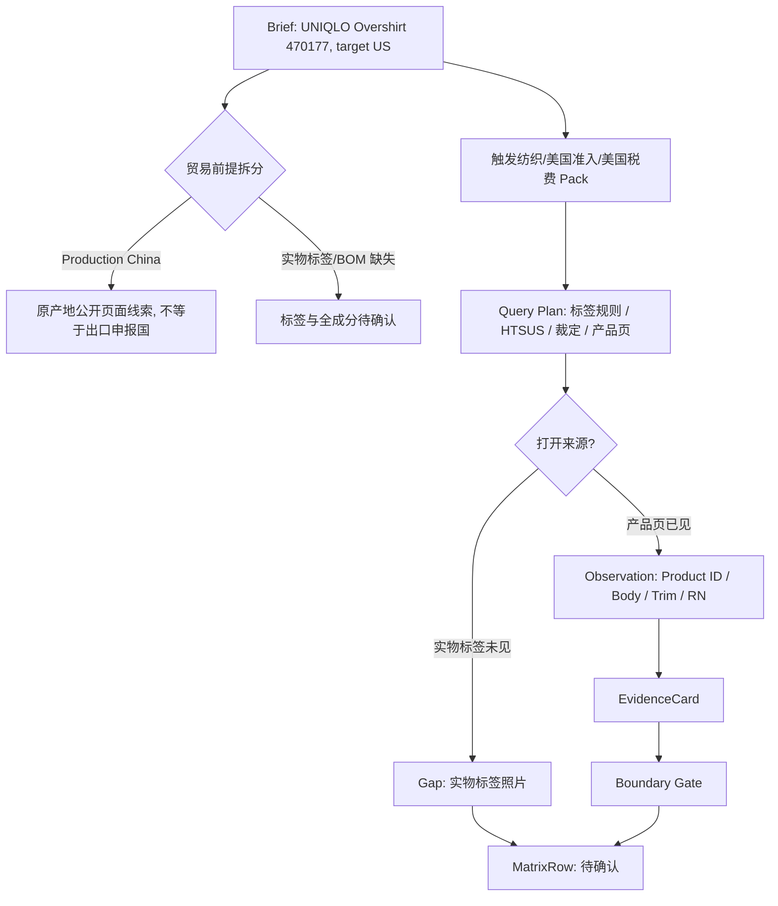

# 产品出海市场分析：端到端运行剧本（Slice 11）

本文件冻结 `产品出海市场分析` 的端到端人工运行剧本。它不是代码，不联网，不新增事实来源，不生成真实税率、认证、价格、趋势或物流结论。

一句话目标：**把用户输入如何一步步变成表格化客观参考讲清楚：Brief -> Source Pack -> Query Plan -> SearchLog / Source -> Observation -> EvidenceCard -> MatrixRow -> Markdown / XLSX。**

## 1. Slice 11 边界

| 项目 | 本轮决定 |
|---|---|
| 目标 | 冻结端到端运行顺序、状态流转、打回点、降级点、用户可见表达和两个样本的人工剧本 |
| 当前仍不做 | 不写代码、不联网、不打开新来源、不创建真实 registry、不计算税率、不判断合规/可运输/值得进入 |
| 适用对象 | 未来 Skill 编排、validator、audit、导出器、eval fixtures、人工验收和用户体验 |
| 核心边界 | 每一步只能把信息升级到证据允许的状态；搜索摘要、Pack、Entry、QueryTemplate、Skill 摘要都不能直接变事实 |

## 2. 端到端总流程

| 步骤 | 输入 | 产物 | 允许状态升级 | 打回 / 降级条件 |
|---:|---|---|---|---|
| 1 | 用户自然语言、URL、PDF、产品名 | `MarketAnalysisBrief` 草案 | 无，只做范围识别 | 产品版本或目标国不清，停在澄清 |
| 2 | Brief 草案 | 冻结 Brief v1 + ProductSubject + TradePremise | 可进入规划 | 出口申报国、原产国、起运国混写则打回 |
| 3 | Brief v1 + 产品属性 | ProductAttributeRecord + trigger tags | 已知字段可标 `verified` 或 `user_provided`，未知字段保留缺口 | 缺关键技术资料，相关模块降级 |
| 4 | Brief + trigger tags | Source Pack 路由结果 | 无事实升级，只得到 Pack / Entry 候选 | Pack 缺失或过期，降级为人工 Query Plan |
| 5 | Pack / Entry | Query Plan | 无事实升级，只得到可审计查询组 | 必需输入不足，查询组标未执行 |
| 6 | Query Plan | SearchLog / 待打开来源 | 只能形成候选线索 | 只有搜索摘要，不生成 Observation |
| 7 | 打开网页/PDF/用户文件 | Source + Observation | 只有可见、可定位内容可进入证据候选 | 来源受限、动态页面不可见、PDF 未抽取则降级 |
| 8 | Observation | EvidenceCard | 按证据类型生成已核实、候选、派生、待确认等状态；COO 要求拆成目标国规则状态和用户材料状态 | 适用范围不匹配、日期缺失、字段冲突、目标国规则与用户材料混写则降级/冲突 |
| 9 | EvidenceCard + Gap + Conflict | Skill 互证 / BoundaryAssertionResult | 通过门禁后才允许进入 MatrixRow | 禁止升级触发则打回或阻断 |
| 10 | 通过门禁的卡片与缺口 | MatrixRowRecord | 用户可见矩阵行 | 未执行模块必须保留行，不得丢失 |
| 11 | MatrixRow + 来源表 | Markdown / XLSX / CSV | 只展示客观参考 | 出现价值判断、内部路径、事实越界则退回改写 |

## 3. 三道门禁在剧本中的位置

| 门禁 | 发生位置 | 检查什么 | 未通过时怎么说人话 |
|---|---|---|---|
| Brief 冻结门 | 步骤 2 | 产品版本、目标国、出口申报国、原产国、起运国是否拆开 | “现在还不能查税率/物流，因为出口申报国或起运信息还没确认。” |
| 证据来源门 | 步骤 7-8 | 是否实际打开来源，是否有定位、日期、适用范围、可见内容 | “这里只看到搜索线索，还没有打开来源，所以先放在候选线索。” |
| 交付边界门 | 步骤 9-11 | 是否把候选税号、网页标签、QCVN、Pack、趋势、价格等升级成结论 | “这个字段只能作为参考/待确认，不能写成已合规或最终税率。” |

## 4. 状态流转剧本

| 当前状态 | 可以升级到 | 必须满足 | 禁止升级 |
|---|---|---|---|
| `user_input_only` | `brief_draft` | 用户给出产品和目标方向 | 直接输出市场结论 |
| `brief_draft` | `brief_frozen` | 产品版本、目标国、贸易前提字段明确或缺口显式 | 忽略出口申报国/原产国/起运国差异 |
| `pack_candidate` | `query_planned` | Pack active 或人工计划明确 | Pack 直接变 EvidenceCard |
| `query_planned` | `search_candidate` | 已执行搜索或形成待打开入口 | 搜索摘要直接变事实 |
| `search_candidate` | `source_opened` | 实际打开公开 URL、PDF 或用户文件 | 只看 snippet 就标已核实 |
| `source_opened` | `observation_recorded` | 抽取可定位内容、日期、适用范围、限制 | 无定位/无可见内容的总结 |
| `observation_recorded` | `evidence_candidate` | 形成 EvidenceCard，并说明支持/不支持 | 自动写最终税率/已合规 |
| `evidence_candidate` | `matrix_ready` | 通过互证和边界校验 | 候选税号、网页标签、QCVN、趋势、价格升级结论 |
| `matrix_ready` | `delivered_with_limitations` | 矩阵包含来源、日期、状态、缺口、未执行模块 | 删除待确认项，写成完整结论 |

## 5. Skill 交接剧本

| 阶段 | 主责 Skill | 交给下游什么 | 下游必须复核什么 |
|---|---|---|---|
| Brief 与属性 | 范围与产品属性识别 | Brief v1、ProductSubject、TradePremise、trigger tags、缺口 | 产品版本是否能支撑法规/税费/物流查询 |
| 市场信号 | 市场趋势、公开报告与价格参考 | 趋势/统计/价格 Query Plan、EvidenceCard、未执行记录 | Google Trends 是否被写成销量，平台价是否被写成成交价 |
| 目的国准入/税费 | 目的国准入、税费与进口规则 | 准入/标签/COO proof of origin/税费 EvidenceCard、候选归类缺口 | 候选税号是否变最终税率，标签规则是否错套，COO 要求是否与用户材料状态混写 |
| 出口国要求 | 出口国监管、出口管制与检验要求 | 出口申报国来源、管制/检验缺口 | 是否把原产国、卖方国、起运国当出口申报国 |
| 物流与申报 | 运输方式、路线、港口与申报节点 | 候选路线、预申报节点、运输文件缺口 | 是否承诺时效、默认港口、忽略危险品/冷链/超限 |
| 交付复核 | 交叉复核与表格化交付 | MatrixRow、来源表、缺口、冲突、未执行模块 | 是否有价值判断、内部路径泄露、来源不够仍称最新 |

## 6. 输出矩阵生成规则

| MatrixRow 来源 | 行状态 | 用户可见表达 | 不得表达 |
|---|---|---|---|
| 通过复核的 EvidenceCard | `已核实 / verified` | “公开来源显示……” + 来源日期/观察日期 | “确定适用所有批次/所有订单” |
| 候选税号 / 候选归类路径 | `候选 / candidate` | “可作为报关归类沟通的候选路径” | “最终税率就是……” |
| 派生计算 | `派生计算 / derived_calculation` | “按已见规格计算：公式……” | “厂商已单独标注……” |
| 技术资料缺口 | `待技术资料确认 / technical_docs_required` | “需要 SDS / UN38.3 / BOM / 标签照片后判断” | “无需提供 / 可忽略” |
| 目标国原产地证明要求 | `required / conditionally_required / normally_not_required / unable_to_verify` | “目标国规则显示……；用户材料状态另列……” | “用户没给所以不需要 COO / Made in 就是 COO / 所有进口都要 COO” |
| 来源受限 | `来源受限 / source_limited` | “入口存在，但本轮未能读取可见内容” | “已读取付费/登录内容” |
| 未执行模块 | `未执行 / not_executed` | “本轮未执行 Google Trends / 价格 / 物流等采集” | 编造趋势、价格或时效 |
| 冲突来源 | `冲突待复核 / conflict_pending_review` | “两个来源说法不一致，需复核” | 强行合并成一个结论 |

## 7. Xing Heng 锂电样本端到端剧本

### 7.1 Brief 冻结

| 字段 | 当前剧本状态 | 用户可见说法 |
|---|---|---|
| 产品 | Xing Heng `48V20Ah` LiFePO4 电池包，Design No. `BAT001.02` | 产品对象可以进入样本剧本 |
| 目标国 | 美国 | 可路由美国目的国准入、税费和市场信号 Pack |
| 原产/制造线索 | 越南制造/装配公开线索 | 只能作为原产地线索，不等同海关最终原产地或出口申报国 |
| 出口申报国 | 未确认 | 出口国要求不能直接按越南或中国写结论 |
| 起运港/机场 | 未确认 | 物流只能列候选入口，不默认海防港 |
| 技术文件 | 缺 UN38.3、SDS、包装资料 | 危险品运输和承运可行性待技术资料确认 |

### 7.2 Pack 路由

| 触发 | 激活 Pack | 产物状态 | 边界 |
|---|---|---|---|
| 目标国美国 | 美国准入、美国税费、美国市场信号 | `pack_candidate` | Pack 不支持最终税率或已合规 |
| 锂电池包 / 960Wh 派生 | 锂电通用规则、物流 Pack、产品原始来源 Pack | `pack_candidate` | 缺 SDS/UN38.3/包装不得可出运 |
| 越南制造线索 | 产品原始来源；越南出口 Pack 仅作为待确认候选 | `needs_user_confirmation` | 不自动确认越南出口申报国 |
| 起运未知 | 跨太平洋物流 Pack 候选入口 | `route_candidate_only` | 不默认港口或最佳方式 |

### 7.3 Query Plan

| 查询组 | 目的 | 必需打开来源类型 | 如果做不到 |
|---|---|---|---|
| 产品资料 | 核对型号、规格、Wh、证书范围 | 产品页、手册、证书/测试报告、用户文件 | 标 `technical_docs_required` 或 `source_limited` |
| 锂电运输 | 查 UN 情形、SDS、UN38.3、包装、危险品运输规则 | 危险品主管来源、承运规则、SDS/UN38.3 文件 | 不判断可出运 |
| 美国税费 / 原产地证明 | 查候选 HTSUS、裁定、附加税、COO/proof of origin、rules of origin 入口 | 官方税则、海关裁定、贸易救济、官方 rules of origin / 协定入口 | 不计算最终税率；不把用户未提供 COO 写成目标国不需要 |
| 出口国要求 | 查出口申报国规则 | 用户确认出口申报国后查对应官方入口 | 出口模块标 `export_country_unconfirmed` |
| 物流 | 查候选路线、预申报和危险品订舱入口 | 港口/机场/承运/海关预申报入口 | 只列候选，不写承诺时效 |
| 市场信号 | 查 Google Trends、公开价格/报告入口 | Trends、公开报告、平台价格入口 | 标未执行或数据不足 |

### 7.4 EvidenceCard 到 MatrixRow

| 字段 | 证据状态 | MatrixRow 表达 | 禁止升级 |
|---|---|---|---|
| 48V / 20Ah | 已有产品公开来源线索 | “公开产品资料显示规格为 48V / 20Ah” | 不扩展到其它型号 |
| 960Wh | 派生计算 | “按 48V × 20Ah 派生为 960Wh” | 不写厂商单独标注 Wh |
| QCVN / Vietnam Register 文件 | 来源边界明确 | “可支持该文件范围内测试/登记线索” | 不等同 UN38.3 或 SDS |
| UN38.3 | 待技术资料确认 | “未公开证实，需向制造商索取对应型号文件” | 不写已具备 UN38.3 |
| SDS | 待技术资料确认 | “制造商公开页未见 SDS，需索取对应版本” | 不写无需 SDS |
| UN3480/UN3481 | 候选运输情形 | “单独电池包通常需按具体运输情形判断 UN3480/UN3481” | 不写最终承运方式 |
| 候选 HTSUS `8507.60.00` | 候选 | “可作为锂离子蓄电池候选归类路径” | 不写最终 10 位归类和最终税率 |
| COO / proof of origin 要求 | 待官方核验 / 条件性状态 | “需按美国官方规则核验普通进口、优惠税率、贸易救济等场景下是否需要原产地证明；用户材料状态另列” | 不因用户未提供而写不需要；不把越南制造页面当 COO |
| 起运港 | 未确认 | “起运港需以订舱/提单/报关文件确认” | 不默认海防港 |

## 8. UNIQLO 纺织样本端到端剧本

### 8.1 Brief 冻结

| 字段 | 当前剧本状态 | 用户可见说法 |
|---|---|---|
| 产品 | UNIQLO Men's Corduroy Overshirt，Product ID `470177` | 产品对象可以进入样本剧本 |
| 目标国 | 美国 | 可路由美国纺织标签、税费、市场信号 Pack |
| Production | China | 可作为公开页面产地线索，不等于出口申报国或起运港 |
| 出口申报国 | 未确认，若用户指定可设中国 | 中国出口 Pack 只有在出口申报国确认为中国时执行 |
| 实物标签/BOM | 未提供 | 标签合规、全成分、辅料和归类仍待确认 |
| 起运港 | 未确认 | 物流只列候选入口，不默认上海/宁波/深圳 |

### 8.2 Pack 路由

| 触发 | 激活 Pack | 产物状态 | 边界 |
|---|---|---|---|
| 目标国美国 | 美国准入、美国税费、美国市场信号 | `pack_candidate` | Pack 不支持最终标签合规或税率 |
| 纺织服装 / 棉 / 灯芯绒线索 | 纺织服装通用规则、产品原始来源 Pack | `pack_candidate` | 网页成分不等于实物全成分 |
| Production: China | 中国出口 Pack 待确认 | `needs_user_confirmation` | Production 不等于出口申报国 |
| 起运未知 | 物流 Pack 候选入口 | `route_candidate_only` | 不默认起运港 |

### 8.3 Query Plan

| 查询组 | 目的 | 必需打开来源类型 | 如果做不到 |
|---|---|---|---|
| 产品资料 | 核对 Product ID、成分、款式、RN、洗护 | UNIQLO 产品页、实物标签、BOM、尺码/规格资料 | 网页字段已见，实物标签/BOM 待确认 |
| 美国标签 / 原产地证明 | 查纺织成分、护理、原产地标识、COO/proof of origin 等规则入口 | 美国主管来源 / 纺织标签指南 / rules of origin 入口 | 不写实物标签已合规；不把 marking 当 COO |
| 美国税费 / 原产地证明 | 查候选 HTSUS、裁定、贸易救济、优惠原产地入口 | 官方税则、海关裁定、贸易救济、rules of origin / 协定入口 | 不写最终归类或税率；不把优惠 proof 泛化所有进口 |
| 中国出口 | 查出口申报、商检/检验监管入口 | 出口申报国确认为中国后查官方入口 | 未确认时标 `export_country_unconfirmed` |
| 物流 | 查候选 FCL/LCL/空运/快递和预申报入口 | 港口/机场/承运/海关预申报入口 | 不承诺时效，不默认港口 |
| 市场信号 | 查服装趋势、公开零售价/平台价、季节/节日入口 | Trends、零售页、平台价格、公开报告 | 零售价不等于外贸成交价 |

### 8.4 EvidenceCard 到 MatrixRow

| 字段 | 证据状态 | MatrixRow 表达 | 禁止升级 |
|---|---|---|---|
| Product ID `470177` | 已有产品页线索 | “公开产品页显示 Product ID 为 470177” | 不扩展到其它 SKU |
| Production: China | 原产地 L1 线索 | “公开页面显示 Production: China” | 不等同海关原产地裁定、出口申报国或起运港 |
| Body/Trim 100% Cotton | 网页字段 | “公开页面显示 Body/Trim 为 100% Cotton” | 不写全成分无动物材料 |
| 8-wale corduroy | 网页字段 | “公开页面显示 8-wale corduroy” | 不替代克重、经纬密度或组织图 |
| 实物标签 | 待确认 | “需实物标签照片核对成分、产地、洗护和 RN 等信息” | 不写标签已完全合规 |
| 候选 HTSUS `6205.20.20` | 候选 | “可作为男式/男童非针织棉制衬衫候选路径” | 不写最终归类或最终税率 |
| COO / proof of origin vs marking | 待官方核验 / 条件性状态 | “需区分原产地标识要求、普通进口文件要求和优惠税率 proof of origin；用户材料状态另列” | 不把 Production: China 或实物 marking 写成 COO 文件已满足 |
| 起运港 | 未确认 | “需提单/订舱/报关文件确认” | 不默认中国主要港口 |

## 9. 两个样本的 Mermaid 流程图

### 9.1 Xing Heng 锂电

### 9.2 UNIQLO 纺织

## 10. 用户可见最终报告骨架

端到端剧本最终应生成这样的报告骨架，而不是长篇散文。

| 区块 | 作用 | 必须包含 |
|---|---|---|
| 1. 本次分析前提 | 让用户先看贸易前提是否对 | 产品版本、目标国、出口申报国、原产国状态、起运地状态 |
| 2. 关键结论边界 | 先告诉用户哪些能看、哪些不能下结论 | 已核实、候选、待确认、未执行 |
| 3. 产品档案与触发项 | 展示产品属性和触发的核验路径 | 材质/规格/电池/危险品/纺织/农产品等标签 |
| 4. 市场信号 | 展示 Trends、报告、价格、季节等状态 | 指标口径、日期、未执行项 |
| 5. 准入、标签与原产地证明 | 展示目的国规则和缺口 | 来源、适用条件、COO/proof of origin 要求状态、用户材料状态、待确认文件 |
| 6. 税费 | 展示候选归类和计算口径 | 候选税号、缺口、税基、有效日期状态 |
| 7. 出口国要求 | 展示出口申报国侧要求 | 出口申报国确认状态、管制/商检/检疫缺口 |
| 8. 物流与预申报 | 展示候选运输方式和节点 | 常见入口、预申报节点、文件缺口、非承诺说明 |
| 9. 外部因素 | 展示有日期的近期因素 | 事件日期、来源、影响链条；未执行则写未执行 |
| 10. 来源与待确认事项 | 方便用户交给供应商/报关行/货代 | 来源表、缺口清单、专业确认清单 |

## 11. 端到端验收断言

| 编号 | 验收断言 |
|---|---|
| E2E-01 | 没有 Brief 冻结，不进入税费、准入、物流结论 |
| E2E-02 | Source Pack / SourceEntry / QueryTemplate 不能直接支持事实 |
| E2E-03 | 搜索摘要只能进入候选线索，打开来源后才有 Observation |
| E2E-04 | EvidenceCard 必须写 supports 和 does_not_support |
| E2E-05 | MatrixRow 必须有状态，未知/未执行/来源受限不能留空 |
| E2E-06 | Xing Heng 不得把 QCVN / Vietnam Register 升级为 UN38.3 / SDS |
| E2E-07 | Xing Heng 不得写可按普通货运输、无需 SDS 或承运可行 |
| E2E-08 | Xing Heng 不得默认海防港或最终税率 |
| E2E-09 | UNIQLO 不得把网页 Body/Trim 升级为全成分或实物标签合规 |
| E2E-10 | UNIQLO 不得把 Production: China 升级为出口申报国、起运港或海关最终原产地裁定 |
| E2E-11 | Google Trends 不得写成销量、GMV、进口量或采购需求 |
| E2E-12 | 平台/零售价不得写成传统外贸成交价、目标价或推荐价 |
| E2E-13 | 物流常见区间不得写成承诺交期或最佳运输方式 |
| E2E-14 | 报告不得包含建议进入、值得开发、市场潜力高、推荐客户类型等价值判断 |
| E2E-15 | 用户可见来源表不得暴露本地路径、hash、token、内部 ID |
| E2E-16 | COO / proof of origin 必须拆成目标国要求和用户材料状态，不得互相推导 |
| E2E-17 | 用户未提供 COO 不得写成目标国不需要 COO |
| E2E-18 | Country of Origin Marking / Made in / Production 不得写成 COO 文件要求或已满足 COO |
| E2E-19 | 优惠税率 proof of origin 不得泛化为所有普通进口都需要 |
| E2E-20 | 无官方/权威来源时，COO 要求只能写 `unable_to_verify` 或待核验 |

## 12. Slice 11 完成标准

| 编号 | 完成标准 |
|---|---|
| C-01 | 已明确 Brief -> Pack -> Query Plan -> Source/Observation -> EvidenceCard -> MatrixRow -> 交付的端到端顺序 |
| C-02 | 已明确三道门禁、状态流转、Skill 交接和打回/降级点 |
| C-03 | 已分别给出 Xing Heng 和 UNIQLO 两个样本的端到端人工剧本 |
| C-04 | 已用 Mermaid 图说明两个样本的关键流转 |
| C-05 | 已给出用户可见最终报告骨架，保持表格化和人话表达 |
| C-06 | 已冻结端到端验收断言，覆盖禁止升级和非价值判断边界 |
| C-07 | 已把目标国原产地证明 / COO 要求纳入端到端 Query Plan、EvidenceCard、MatrixRow 和交付门禁 |
